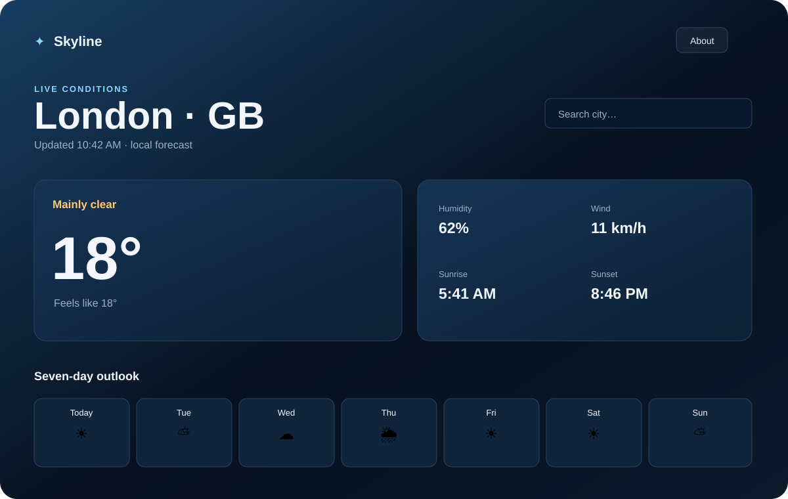

# Skyline Weather

A minimal, single-page weather app that runs by opening `index.html` directly in a browser.

Current release: **v1.0.1**

## About

Skyline Weather is a quiet, single-page weather dashboard designed for quick daily checks. Search for a city, see the current conditions, compare the seven-day outlook, and refresh the forecast without accounts, setup, or distracting UI. It runs entirely in the browser and remembers the last searched city locally.

## Hosted app

[Open Skyline Weather](https://analogarcade.github.io/skyline-weather/)

## Features

- Search any city and press Enter or Search
- Current conditions and seven-day forecast
- Responsive, fixed-screen layout with no page scrolling
- LocalStorage remembers the last searched location
- No login, API key, build step, backend, or installation
- Open-Meteo geocoding and forecast APIs
- Built-in About panel with privacy details

## Run

Open `index.html` in a modern browser. Internet access is required for live weather data.

## Privacy

No credentials, tracking, analytics, or personal data are included. The app sends only the searched city to Open-Meteo's public APIs. A location is not collected automatically.
